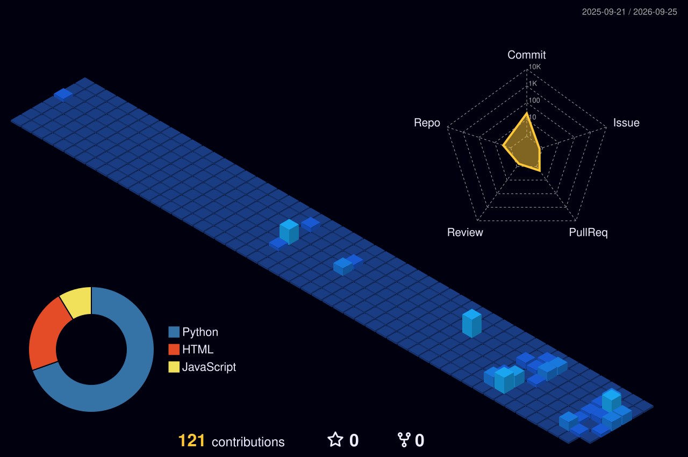

# Olá, eu sou o Gabriel! 👋

🚀 **Data Analyst & Web Developer (Freelancer)**  
Bacharel em Ciência da Computação, focado em transformar dados em decisões estratégicas através de dashboards interativos e em desenvolver aplicações web modernas e velozes.

---

### 💻 Sobre Mim

- 🎓 Graduado em **Ciência da Computação**
- 📊 Especializado em **Análise de Dados, Tratamento (ETL) e Business Intelligence**
- 🌐 Desenvolvedor de **sites e aplicações web** leves e otimizadas
- ⚙️ Experiência em rotinas de TI, automação de processos e gestão de sistemas

---

### 🛠️ O que eu faço (Serviços & Soluções)

- 📊 **Dashboards Interativos:** Construção de painéis no Power BI para visualização clara de métricas e suporte a tomadas de decisão.
- 🧹 **Tratamento e Limpeza de Dados:** Automação de rotinas de ETL e higienização de bases complexas utilizando Python (Pandas) e Excel.
- 🌐 **Desenvolvimento Web:** Criação de sites modernos, rápidos e responsivos utilizando **Svelte** e hospedagem na **Vercel**.

---

### 🧰 Tecnologias & Ferramentas

#### Dados & Analytics

#### Desenvolvimento Web & Infra

---

### 📬 Vamos nos conectar?

--- 

